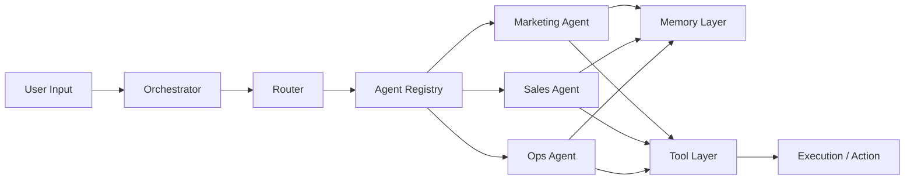

# Multi-Agent Business Operator

An open framework for designing and orchestrating specialized AI agents with shared memory and tool registries.

Most AI systems today are chat interfaces.  
This project models operational AI systems.

---

## Why This Exists

AI-native products should not be single prompts wrapped in UI.

They require:
- Orchestration
- Specialized agents
- Shared memory
- Tool execution
- Observable decision loops

This repository provides a clean architectural foundation for building AI-native systems.

---

## Architecture Overview



---

## Core Components

### Orchestrator
Coordinates agent selection and execution.

### Agent Registry
Dynamic registry of available agents.

### Agents
Specialized units with defined responsibilities:
- Marketing Agent
- Sales Agent
- Operations Agent

### Memory Layer
Stores contextual embeddings and retrieves relevant history.

### Tool Layer
Provides structured external actions (APIs, web search, CRM, etc.).

---

## Tech Stack

- Python 3.11+
- FastAPI
- Pydantic
- OpenAI SDK
- Vector memory (in-memory for v1)
- Docker

---

## Getting Started

```bash
git clone https://github.com/davidgarzon/multi-agent-business-operator.git
cd multi-agent-business-operator
pip install -r requirements.txt
uvicorn app.main:app --reload
```

---

## Roadmap

- [x] Project structure
- [ ] BaseAgent abstraction
- [ ] Agent registry
- [ ] Basic orchestrator logic
- [ ] Memory layer (vector store)
- [ ] Tool interface
- [ ] Event-driven orchestration
- [ ] Observability layer

---

## Design Philosophy

AI systems should be:

- Modular
- Observable
- Memory-driven
- Tool-enabled
- Business-impact oriented

This is not a chatbot framework.  
It is a system architecture blueprint.