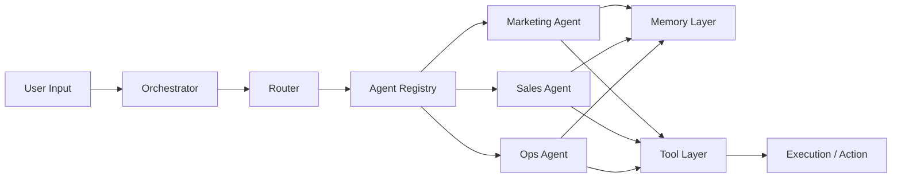
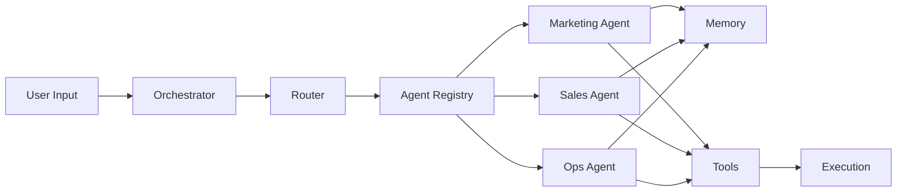

# Multi-Agent Business Operator

An open framework for designing and orchestrating specialized AI agents with shared memory and tool registries.

Most AI systems today are chat interfaces.
This project models operational AI systems.

---

## Quickstart (30s)

Run the API:

```bash
python -m venv .venv
source .venv/bin/activate
pip install -r requirements.txt
python -m uvicorn app.main:app --reload
```

In another terminal:

```bash
./examples/run_demo.sh
```

Run a different payload:

```bash
./examples/run_demo.sh task_qualify_lead.json
./examples/run_demo.sh task_ops_automation.json
```

---

## Why This Exists

AI-native products should not be single prompts wrapped in UI.

They require:
- Orchestration
- Specialized agents
- Shared memory
- Tool execution
- Observable decision loops

This repository provides a clean architectural foundation for building AI-native systems.

---

## Architecture Overview



---

## Core Components

- **Orchestrator**: Coordinates agent selection and execution.
- **Router**: Selects the right agent for a task.
- **Agent Registry**: Registry of available agents.
- **Agents**: Specialized units (Marketing / Sales / Ops).
- **Memory Layer**: Stores and retrieves context (v1: minimal).
- **Tool Layer**: Structured external actions (APIs, CRM, etc.).

---

## Tech Stack

- Python 3.12+
- FastAPI
- Pydantic

---

## Demo

### 1) Start the API

```bash
python -m uvicorn app.main:app --reload
```

### 2) Execute a task

Option A — script:

```bash
./examples/run_demo.sh
```

Option B — raw curl:

```bash
curl -sS -X POST http://127.0.0.1:8000/tasks/execute \
  -H "Content-Type: application/json" \
  -d '{
    "type": "MARKETING_PLAN",
    "goal": "Create a 30-day plan for a local dentist",
    "context": {"country":"ES"},
    "constraints": {"budget_eur": 300},
    "priority": 3
  }' | python -m json.tool
```

---

## Roadmap

- [x] Project structure
- [x] Task routing + orchestrator + API endpoint
- [x] Runnable demo script (`examples/run_demo.sh`)
- [ ] BaseAgent abstraction
- [ ] Memory layer (vector store)
- [ ] Tool interface
- [ ] Event-driven orchestration
- [ ] Observability layer

---

## Design Philosophy

AI systems should be:
- Modular
- Observable
- Memory-driven
- Tool-enabled
- Business-impact oriented

This is not a chatbot framework.
It is a system architecture blueprint.
# Multi-Agent Business Operator

An open framework for designing and orchestrating specialized AI agents with shared memory and tool registries.

Most AI systems today are chat interfaces. This project models **operational AI systems**.

---

## Quickstart

### 1) Run the API

```bash
python -m venv .venv
source .venv/bin/activate
pip install -r requirements.txt
python -m uvicorn app.main:app --reload
```

### 2) Run a demo task

```bash
./examples/run_demo.sh
```

Try other payloads:

```bash
./examples/run_demo.sh task_qualify_lead.json
./examples/run_demo.sh task_ops_automation.json
```

---

## Why this exists

AI-native products should not be single prompts wrapped in a UI.

They require:
- Orchestration
- Specialized agents
- Shared memory
- Tool execution
- Observable decision loops

This repository provides a clean architectural foundation for building AI-native systems.

---

## Architecture



---

## Components

- **Orchestrator**: coordinates selection + execution.
- **Router**: maps tasks → agents.
- **Agent Registry**: list of available agents.
- **Agents**: Marketing / Sales / Operations.
- **Memory**: stores and retrieves context (v1: minimal).
- **Tools**: structured external actions (future).

---

## API

Endpoint:

- `POST /tasks/execute`

Raw curl example:

```bash
curl -sS -X POST http://127.0.0.1:8000/tasks/execute \
  -H "Content-Type: application/json" \
  -d '{
    "type": "MARKETING_PLAN",
    "goal": "Create a 30-day plan for a local dentist",
    "context": {"country":"ES"},
    "constraints": {"budget_eur": 300},
    "priority": 3
  }' | python -m json.tool
```

---

## Tech stack

- Python **3.12+**
- FastAPI
- Pydantic

---

## Roadmap

- [x] Project structure
- [x] Task routing + orchestrator + API endpoint
- [x] Runnable demo script (`examples/run_demo.sh`)
- [ ] BaseAgent abstraction
- [ ] Memory layer (vector store)
- [ ] Tool interface
- [ ] Event-driven orchestration
- [ ] Observability layer

---

## Design philosophy

AI systems should be:
- Modular
- Observable
- Memory-driven
- Tool-enabled
- Business-impact oriented

This is not a chatbot framework. It is a system architecture blueprint.